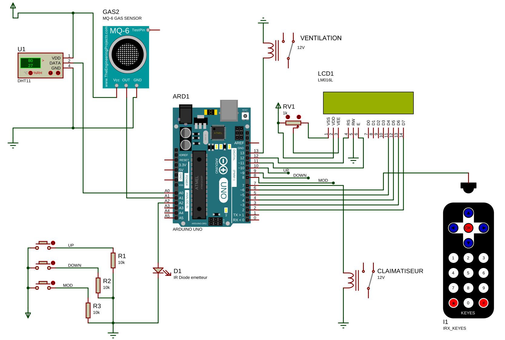

Voici un schéma réel du projet avec tous les capteurs et les composants déjà expliqués :

Dans ce lien [IRX-Proteus](https://github.com/chayanforyou/IRX-Proteus), il y a un composant développant une bibliothèque de télécommande IR pour PROTEUS-ISIS. 
